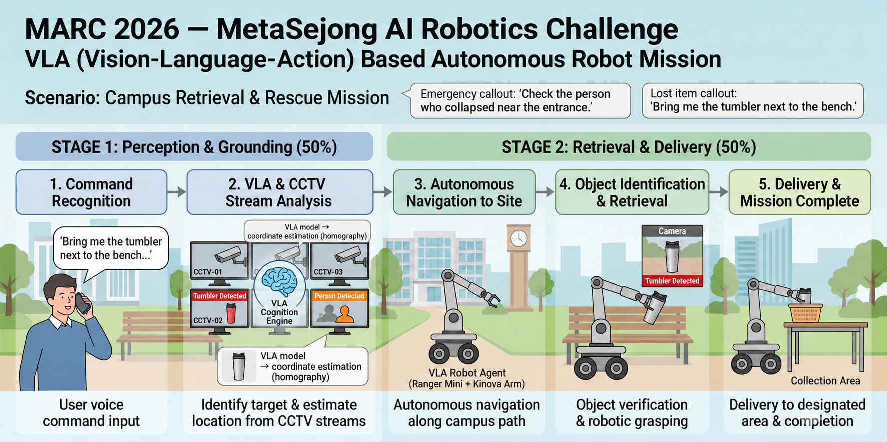

# IEEE MetaCom 연계 MARC 2026

### 자연어 명령 기반 다중 카메라 목표 탐색 및 로봇 회수·배송 시스템

**MetaSejong AI Robotics Challenge(MARC) 2026**에 참가하여 자연어 명령에서 목표 객체를 파악하고, 다중 CCTV 영상에서 해당 객체의 **3D 위치를 추정해 로봇의 이동·회수·배송으로 연결하는 시스템**을 구현했습니다.

시스템은 **Stage 1의 목표 객체 탐색 및 위치 추정**과 **Stage 2의 자율주행 및 로봇팔 조작**으로 구성됩니다. 자연어 이해, 객체 탐지, 공간 Grounding, 기하 변환, 경로 계획 및 조작 모듈을 연결해 Vision–Language–Action 흐름을 구성했습니다.

이 저장소는 대회 참가 과정에서 개발한 코드와 자료를 공개 가능한 범위로 정리한 저장소입니다.

## 시스템 구성

### Stage 1 — 목표 객체 탐색 및 위치 추정

자연어 명령에서 **목표 객체와 주변 기준물, 위치 관계**를 추출합니다. 여러 CCTV 영상의 객체 탐지 결과와 명령의 단서를 결합해 목표 객체와 해당 객체가 보이는 카메라를 선택합니다.

카메라 기하 정보를 활용해 영상 속 위치를 **시뮬레이션 공간의 3D 월드 좌표**로 변환하고 목표 위치를 제출합니다.

- **자연어 이해:** Qwen2.5-3B-Instruct를 활용한 명령 해석
- **객체 탐지:** YOLO11s 기반 전체 영상 탐지
- **소형 객체 탐지:** 랜드마크 중심 ROI 데이터 및 전용 탐지 모델 활용
- **공간 Grounding:** 명령 해석 결과와 탐지 결과를 결합한 목표 객체·카메라 선택
- **위치 추정:** 카메라 기하 변환과 기준점 보정을 통한 3D 좌표 추정

### Stage 2 — 자율주행 및 회수·배송

LiDAR로 장애물을 파악하고 A* 기반 경로 계획으로 목표 위치까지 이동합니다. 깊이 영상으로 파지 위치를 보정한 뒤 로봇팔로 객체를 회수하여 지정된 장소로 배송합니다.

## 팀 구성과 역할

**Team dongdong · Dongguk University, Seoul, Republic of Korea**

| 팀원 | 단계 | 학과 | 담당 |
| --- | --- | --- | --- |
| 장은재 | Stage 1 | Department of AI Convergence | 자연어 명령 해석(NLU) |
| 김은서 | Stage 1 | Division of AI Software Convergence | 객체 탐지 및 Visual Grounding |
| 박효빈 | Stage 1 | Div. of Electronics & Electrical Eng. | 카메라 기하 변환 |
| 김연철 | Stage 2 | Mechanical, Robotics & Energy Eng. | 자율주행 및 경로 계획 |
| 오민수 | Stage 2 | Mechanical, Robotics & Energy Eng. | 로봇팔 조작 및 Pick & Place |

## 개발 환경 및 주요 기술

| 구분 | 기술 |
| --- | --- |
| 개발 환경 | Ubuntu 22.04 · ROS 2 Humble · Docker |
| 시뮬레이션 | Isaac Sim 5.1.0 |
| 자연어 이해 | Qwen2.5-3B-Instruct (Q4_K_M) |
| 객체 탐지 | YOLO11s · ROI 전용 탐지 모델 |
| 공간 인식 | Visual Grounding · 카메라 기하 변환 |
| 이동 및 조작 | LiDAR · A* · 깊이 영상 · 로봇팔 제어 |

## 대회 운영 조건

- **오프라인 실행:** Docker 이미지 빌드 중에는 인터넷을 사용할 수 있지만, 채점 실행 중에는 인터넷 연결 없이 동작해야 합니다.
- **통합 실행:** 제출 시스템은 `docker compose up`으로 실행할 수 있도록 구성해야 합니다.
- **제한시간:** 명령 해석부터 목표 탐색과 이동·회수까지 정해진 시간 내에 수행해야 합니다.
- **비공개 평가 환경:** 채점 시나리오의 환경과 목표 객체는 개발 시나리오와 달라질 수 있습니다.

## 저장소 안내

| 경로 | 내용 |
| --- | --- |
| `nlu/` | 자연어 명령 해석 |
| `detection/` | 객체 탐지 및 Visual Grounding |
| `geometry/` | 카메라 기하와 좌표 변환 |
| `demo/` | 단계별 에이전트와 통합 실행 코드 |
| `manipulation/` | 로봇팔 조작 |
| `marc_sdk/` | 대회 SDK 관련 코드 |
| `simulation-platform/` | 시뮬레이션 플랫폼 참고 자료 |
| `tools/` | 데이터 처리 및 검증 도구 |
| `docs/` | 평가 로그와 학습 결과 자료 |

대회 환경과 연동해 실행하려면 별도로 제공받은 인증 정보를 환경 변수로 설정해야 합니다.

외부 코드와 자료의 출처 및 라이선스는 [NOTICES.md](NOTICES.md)를 참고하세요.

## 대회 결과

- 주최 측의 **비공개 시나리오 기반 예선 평가를 거쳐 MARC 2026 본선 진출**
- **IEEE MetaCom 2026 논문 채택**
  - *Language-Guided Object Retrieval via Multi-Camera Grounding and Sensor-Driven Navigation*
  - 본선 발표 및 출판 절차 완료 후 IEEE Xplore 게재 예정
- **2026년 11월 중국 시안에서 본선 발표 및 시연 예정**
